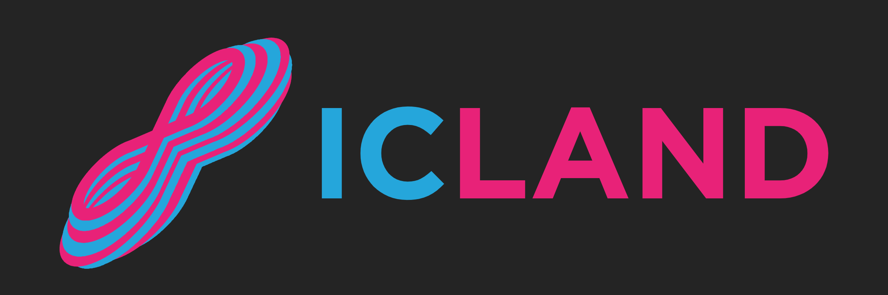

# ICLand

ICLand powers NFT communities by connecting web3 identities to social spaces &amp; delivering key token data to communities. First tools: Discord token holder verification; sales &amp; listings bot.

## What it does

The first tools to be offered are:
 - Discord token holder verification [Operational]
 - Sales & listings Discord bot [To be released soon]

Projects will be able to acquire access to the tools either by holding DogFinity NFTs.

**Discord Token Holder Verification**
The tool provides holder roles across all Discord servers for token holders of NFT collections or similar ICP tokenized communities integrated with ICLand. Token holders only need to connect their Discord accounts and wallets to ICLand’s interface a single time. The tool will also offer further customization for holder-specific roles.

**Sales & listings Discord bot**
The ICLand Discord bot creates and updates channels with new NFT token listings and sales.

**Integration Process**
To be made available during beta, any project will be able to integrate ICLand by acquiring the required NFTs by ICLand and connecting their wallets and Discord handles to ICLand. Once done, they will be able to add the ICLand bot to their Discord server and finish the integration.

## Inspiration

Tokenized communities in the IC ecosystem are destined to bloom with the growth of NFTs and fungible tokens. This creates the need for gated-social spaces and for communities to stay updated with the market activity of their tokens.

Discord remains the preferred platform for social spaces of tokenized communities across all blockchains. In more mature markets such as Ethereum and Solana, most projects use third-party solutions to verify the holder status of members. This allows gated channels and other social spaces exclusive to token holders, polling holders for matters that can range from governance to trivial topics, or simply segmenting members. In most cases, projects rely on third-party solutions (e.g. collab.land) which are often more convenient and cheaper than developing a verification system in-house.
At the same time, communities often desire to stay updated with the market activity of their tokens. A Discord bot that populates channels with NFT sales and listings is a convenient way to provide opportunities (new attractive listings) and market updates (sales, record sales, listings) to holders.
Thus, ICLand aims to power the IC’s tokenized communities given the lack of services providing such essential functionatiltes.

## How we built it

**- Server**

- Written in Typescript
- Hosts Discord Bot that handle users authentication, assigns special roles to holders, and collect and share market activity data of their collections’ tokens through channels
- API to integrate the functionalities between the dapp and the Discord bot

**- Backend Canister**

- Written in Motoko
- Has an actor that handles 2 HashMap databases, one for the guild and one for the users. Both databases have methods to create, update, find, and findAll records.
- In the future, these canisters will verify if NFT project admins own the required NFTs to integrate ICLand to their servers

**- Frontend Canister**

- Written in Nextjs with Typescript
- UI that allows:
  - users to connect their wallets and Discord accounts to ICLand
  - project leaders to connect their wallets and Discord accounts to ICLand, add the bot to their servers and integrate ICLand's tools after submitting their project's information.

## Challenges we ran into

- The challenge was to design a scalable solution without using web2 database systems while providing a seamless IaaS solution that will support most ICP projects.

## What's next for ICLand

Future steps entail:

- Launch the product in beta for projects to test
- Further customization for holder-specific roles
- Twitter bot providing activity data;
